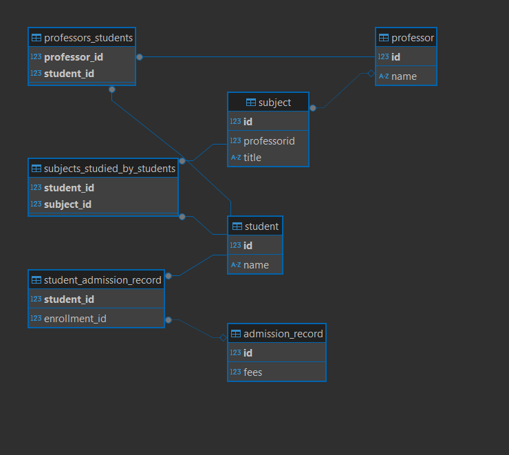

 # 🎓 College Management System

A Spring Boot application for managing key entities in a college ecosystem: Professors, Students, Subjects, and Admission Records. This RESTful backend provides full CRUD capabilities and utilizes MySQL as the persistent data store.

---

## 🚀 Features

* CRUD operations for:

  * Professors
  * Students
  * Subjects
  * Admission Records
* DTOs for clean data exchange
* Layered architecture: Controller → Service → Repository
* MySQL database integration
* JPA and Hibernate ORM for data persistence
* Relationship mappings:

  * OneToOne: Student ↔ AdmissionRecord
  * ManyToMany: Students ↔ Subjects
  * ManyToMany: Professors ↔ Students
  * OneToMany: Professors → Subjects

---

## 🔗 Entity Relationships

 🧑‍🎓 Student Entity

* One-to-One with AdmissionRecord:

  * Each Student has exactly one AdmissionRecord that stores admission details like admission date and number.
  * This relationship is bidirectional, with Student owning the foreign key.

* Many-to-Many with Subject:

  * A Student can enroll in multiple Subjects.
  * Each Subject can have multiple Students enrolled.
  * Implemented using a join table (e.g., student\_subject).

* Many-to-Many with Professor:

  * A Student can be mentored by multiple Professors.
  * A Professor can mentor multiple Students.
  * Implemented using a join table (e.g., student\_professor).

📄 AdmissionRecord Entity

* One-to-One with Student:

  * Each AdmissionRecord is uniquely associated with one Student.
  * The Student entity owns the relationship.
  * Useful for storing student-specific onboarding or historical data.

📚 Subject Entity

* Many-to-Many with Student:

  * Each Subject can have many Students enrolled.
  * Each Student can enroll in many Subjects.
  * This is a symmetric, bidirectional relationship.

* Many-to-One with Professor:

  * Each Subject is taught by exactly one Professor.
  * A Professor can teach multiple Subjects.

👨‍🏫 Professor Entity

* One-to-Many with Subject:

  * A Professor can teach multiple Subjects.
  * Each Subject is taught by only one Professor.

* Many-to-Many with Student:

  * A Professor can mentor multiple Students.
  * A Student can be mentored by multiple Professors.

In summary:

* Student ↔ AdmissionRecord → One-to-One
* Student ↔ Subject → Many-to-Many
* Professor → Subject → One-to-Many
* Professor ↔ Student → Many-to-Many

---

## 🛠️ Technologies Used
* intelliJ
* Java 21
* Spring Boot 3.4.5
* Spring Data JPA
* Hibernate
* MySQL
* Maven
* ModelMapper (optional for DTO mapping)

---

## 🧪 API Endpoints

Each entity has a dedicated controller with the following typical REST endpoints:

* GET /api/{entity}
* GET /api/{entity}/{id}
* POST /api/{entity}
* PUT /api/{entity}/{id}
* DELETE /api/{entity}/{id}

📘 Example:

```bash
GET /api/students
POST /api/professors
PUT /api/subjects/5
```

---

## ⚙️ Database Configuration

In application.properties or application.yml:

```properties
spring.datasource.url=jdbc:mysql://localhost:3306/college
spring.datasource.username=root
spring.datasource.password=yourpassword
spring.jpa.hibernate.ddl-auto=create
spring.jpa.show-sql=true
```

---

## ⚙️ Database Diagram

 


---

## 🧰 How to Run

1. Clone the repo:
   git clone [https://github.com/yourusername/college-management-system.git](https://github.com/yourusername/college-management-system.git)

2. Configure MySQL credentials in application.properties

3. Run the application:
   ./mvnw spring-boot\:run

4. Test endpoints via Postman or Swagger (if enabled)

---

## 📌 Future Enhancements

* Authentication & Authorization with Spring Security
* Pagination and Sorting
* Swagger UI Documentation
* Exception handling improvements with ControllerAdvice
* Unit & Integration Tests

---

 


 
